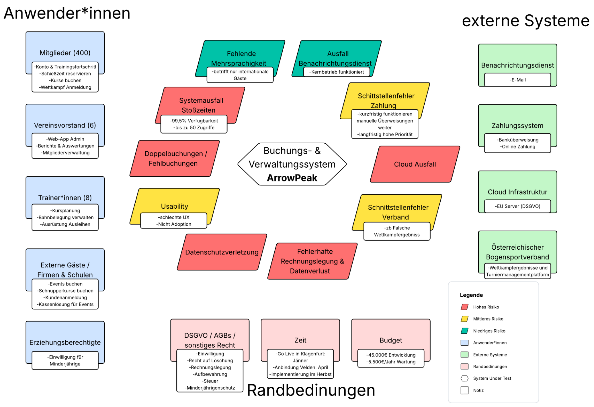

# Digitales Vereins- und Buchungssystem „ArrowPeak“
### End-to-End Case Study: Requirements Engineering (IREB) & Software Quality Assurance (ISTQB / ISO 29119-3)

Dieses Repository demonstriert einen durchgängigen Software-Lifecycle: Von der Systemabgrenzung und Anforderungserhebung nach IREB-Standards bis hin zum methodischen Software-Testing und der fundierten Vendor-Evaluierung (easyVerein) nach ISTQB- und ISO/IEC/IEEE 29119-3-Standards.

---

## Projekt-Steckbrief & Rollen

* **Rollen:** Product Owner / Test Analyst (Requirements Engineering, Testfalldesign, Testdurchführung)
* **Angewandte Standards:** 
  * Requirements Engineering: **IREB CPRE** (Satzschablone nach Mike Cohn, Kano-Modell)
  * Software Testing: **ISTQB CTFL** & **ISO/IEC/IEEE 29119-3** (Äquivalenzklassen, Grenzwertanalyse, IDOR-Security)
  * Qualitätskriterien: **ISO/IEC 25010**
* **Zentrale Artefakte:** Systemkontextdiagramm, Product Backlog, Testlandkarte (Risikoanalyse), Testfallkatalog (27 Testfälle inkl. Review-Protokoll), Testprotokoll & Evaluierungsbericht

---

## Ausgangsszenario & Business Problem

Der Bogensportverein „ArrowPeak“ verwaltet über 400 aktive Mitglieder und zwei Standorte (Halle Klagenfurt, Außengelände Velden). Bislang dominierten fehleranfällige manuelle Prozesse (Papierlisten, Inselkalender). 

Ziel der Case Study war:
1. Die vollständige funktionale und nicht-funktionale Spezifikation einer modularen Plattform.
2. Die systematische Eignungsprüfung einer marktführenden Standard-Softwarelösung (easyVerein) gegen die definierten Kernanforderungen.

---

## 1. Systemkontext & Abgrenzung (IREB)

Zur Vermeidung von Scope-Creep wurden Schnittstellen, Akteure und Nicht-Ziele präzise abgegrenzt:

* **Schnittstellen:** Österr. Bogensportverband (Turnier-API), Benachrichtigungsdienst, Kassenlösung (RKSV), EU-Cloud-Infrastruktur.
* **Bewusst ausgeschlossen:** Lokale POS-Kassenhardware, Offline-Modus, Presse-/Medienverwaltung.

---

## 2. Product Backlog (Auszug)

Das Backlog (siehe `ArrowPeak_UserStories.xlsx`) umfasst 5 Epics und über 20 User Stories.

* **Beispiel Buchung (US-05):** *„Als Mitglied möchte ich verfügbare Schießzeiten in Echtzeit sehen, damit ich einen freien Bahnplatz ohne Doppelbuchung reservieren kann.“*
* **Beispiel Minderjährigenschutz (US-03):** *„Als Vereinsvorstand möchte ich minderjährige Mitglieder kennzeichnen, damit sichergestellt ist, dass vor deren Buchung eine Einwilligung der Erziehungsberechtigten vorliegt.“*

---

## 3. Testplanung & Produktrisikoanalyse (ISO 25010)

Vor der Testdurchführung wurden Kernrisiken und Qualitätsmerkmale nach ISO 25010 in einer Testlandkarte priorisiert:

* **Kritische Produktrisiken:** Datenschutzverletzung (DSGVO Art. 7), Verstöße gegen das Minderjährigenschutzgesetz, Datenverlust bei Abrechnungen und Doppelbuchungen in Stoßzeiten.

---

## 4. Software-Evaluierung & Testdurchführung (easyVerein)

Anhand des Testfallkatalogs (`ArrowPeak_Testfallkatalog_v4.xlsx` – 27 Testfälle) wurde die Standard-SaaS-Lösung *easyVerein* im praktischen Einsatz evaluiert.

### Testergebnis-Übersicht:
* **Gesamt-Testfälle:** 27 (100 %)
* **Bestanden:** 8 (30 %) – z. B. Basis-Buchungskern, Rechnungs-Pflichtfelder (§11 UStG), IDOR-Zugriffsschutz
* **Fehlgeschlagen:** 4 (15 %) – z. B. fehlende Stornogebührenlogik (<24h), Stornierbarkeit abgelaufener Buchungen
* **Nicht testbar (Funktion fehlt in Standardsoftware):** 15 (55 %)

### Kritische Abweichungen (Auszug ISTQB-Fehlerliste):
* **F-01 (Klasse 1 – Kritisch):** Minderjährigen-Flag und automatisierte Buchungsblockade fehlen systemseitig vollständig (Verstoß gegen gesetzliche Vorgaben für Jugendkurse).
* **F-04 (Klasse 2 – Hoch / DSGVO Art. 7):** Keine einsehbare Einwilligungshistorie und kein integrierter DSGVO-Widerrufsworkflow für Mitglieder.

---

## 5. Management Summary & Freigabeempfehlung

> **Entscheidung: easyVerein wird für den Produktivbetrieb NICHT FREIGEGEBEN.**

Obwohl die Basisfunktionalitäten für allgemeine Vereine vorhanden sind, scheitert die Standardlösung an den regulatorischen K.O.-Kriterien (Minderjährigenschutz und DSGVO) sowie der fehlenden Verbands-API. Als Product Owner / Test Lead wurde empfohlen, keine kostspieligen Custom-Workarounds aufzusetzen, sondern alternative SaaS-Lösungen (z. B. clubdesk, verein.cloud) gezielt anhand der K.O.-Kriterien vorzufiltern.
