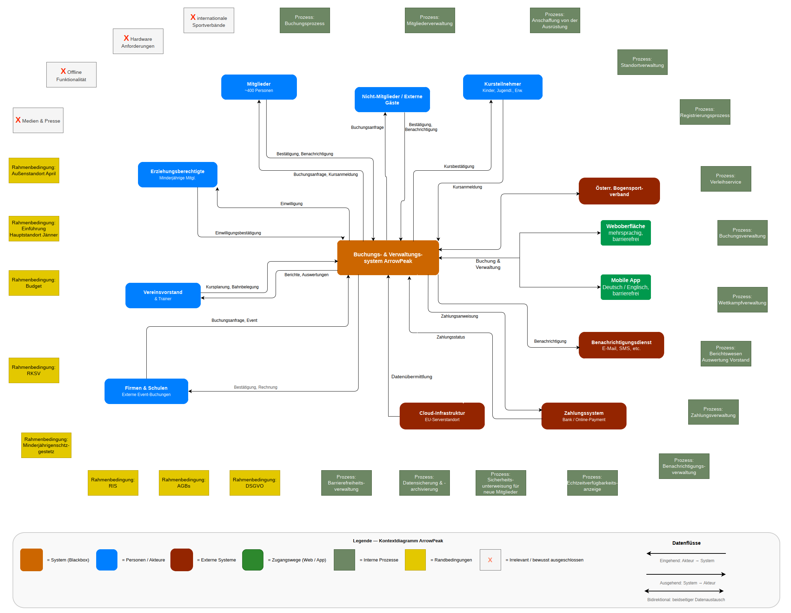

# Digitales Vereins- und Buchungssystem „ArrowPeak“
### Case Study: Angewandtes Requirements Engineering & Product Ownership nach IREB-Standards

Dieses Projekt demonstriert die strukturierte Systemkontextabgrenzung, Anforderungsanalyse, Backlog-Strukturierung und das Change Management zur Ablöse gewachsener, manueller Prozesse (Papierlisten, Inselkalender) durch eine cloudbasierte Plattform für einen Sportverein mit über 400 Mitgliedern und zwei Standorten.

---

## Projekt-Steckbrief & Rolle

* **Rolle:** Product Owner / Requirements Engineer (Lead User Story Review & Change Decisions)
* **Standard:** IREB (CPRE Foundation Level)
* **Artefakte:** Systemkontextdiagramm, Ermittlungsplan (Kano-Modell), Attributierungsschema, Product Backlog (20+ User Stories inkl. Epics & Akzeptanzkriterien), Change-Request-Prozess

---

## 1. Systemkontext & Abgrenzung (Scope)

Um Scope-Creep zu verhindern, wurden die Systemgrenzen, externe Schnittstellen sowie bewusst ausgeschlossene Aspekte frühzeitig definiert.

* **Relevante Akteure:** Mitglieder, Trainer, Vorstand, Nicht-Mitglieder/Gäste, Erziehungsberechtigte
* **Schnittstellen:** Österr. Bogensportverband (Turnier-API), Benachrichtigungsdienst (E-Mail/SMS), Kassenlösung (RKSV), EU-Cloud-Infrastruktur
* **Bewusst ausgeschlossen:** Lokale Kassenhardware (im aktuellen Software-Scope nicht enthalten), Offline-Modus (reine Online-Cloudlösung), Medien-/Pressearbeit

---

## 2. Ermittlungsstrategie nach dem Kano-Modell

Die Anforderungen wurden über fünf kombinierte Ermittlungstechniken erhoben, um Basisfaktoren abzusichern und Begeisterungsfaktoren strukturiert zu identifizieren:

| Technik | Kano-Zuordnung | Adressierte Quellen | Ziel / Mehrwert |
| :--- | :--- | :--- | :--- |
| **Dokumentenanalyse** | Basis- & Leistungsfaktoren | Papierlisten, DSGVO, Statuten | Aufdecken impliziter Geschäftsregeln vor Stakeholderkontakt |
| **Interviews** | Leistungsfaktoren | Vorstand, Trainer, Mitglieder | Detaillierte Erhebung von Prozessen und Erwartungen |
| **Feldbeobachtung** | Basisfaktoren | Vor-Ort-Abläufe (2 Standorte) | Identifikation informeller Workarounds bei Platzbelegungen |
| **Online-Fragebogen** | Leistungsfaktoren | Gesamte Mitgliederbasis (400) | Statistische Priorisierung von Kernfeatures |
| **Kreativworkshop** | Begeisterungsfaktoren | Vorstand, Trainer, Mitglieder | Ideenfindung (Gamification, automatisierte Benachrichtigungen) |

---

## 3. Product Backlog (Auszug User Stories)

Das vollständige Backlog (siehe `ArrowPeak_UserStories_NEU.xlsx`) umfasst 5 Epics und über 20 User Stories, formuliert nach der Mike-Cohn-Satzschablone mit messbaren Akzeptanzkriterien.

### Beispiel: Buchungssystem (Epic E2)

* **Story:** `US-05` | **Stabilität:** Vorläufig | **Status:** Entwurf
* **Formulierung:** *„Als Mitglied möchte ich verfügbare Schießzeiten in Echtzeit sehen, damit ich einen freien Bahnplatz ohne Doppelbuchung reservieren kann.“*
* **Akzeptanzkriterien:**
  1. Gebuchte Plätze werden innerhalb von maximal 2 Sekunden systemweit für andere Nutzer als belegt markiert.
  2. Bei zeitgleicher Reservierungsanfrage erhält die zuerst eingegangene Transaktion den Platz; der zweite Nutzer erhält eine Fehlermeldung mit Alternativvorschlägen.

---

## 4. Change-Enablement-Prozess

Zur Beherrschung von gesetzlichen Vorgaben (DSGVO, RKSV) und Stakeholder-Wünschen greift ein formaler 5-Stufen-Prozess:

1. **Erfassung:** Dokumentation von Ursache, Auslöser und betroffenen Anforderungen.
2. **Folgenabschätzung:** Analyse über Traceability-Matrizen und Kontext-IDs.
3. **Entscheidung:** Priorisierung und Freigabe durch den Product Owner (Vorstand).
4. **Umsetzung & Versionierung:** Inkrementierung von Dokumenten und Code.
5. **Verifizierung:** Regressionstests und Abnahme gegen aktualisierte Akzeptanzkriterien.
